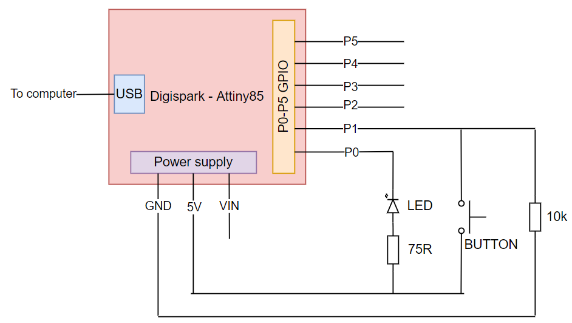

# Sudo reboot button
Reboot button for Debian-based operating systems. 
After pressing, device pastes a command "sudo reboot now" and push "enter" (↵) in active window. To make device work use it only in active terminal (Xterm, UXterm etc.).

## Used materials
- DigiSpark Attiny85,
- big press button with build-in LED diode,
- resistors: 75R, 10k,
- mini USB cable
- goldpin cables and connectors

## Schematic diagram

## Software
Software was created in Arduino IDE. 
To compile code and write it to DigiSpark you should have installed:
- DigiSpark Attiny85 Arduino library - [DigistumpArduino](https://github.com/digistump/DigistumpArduino)
- DigiSpark driver. After installation device sholud be recognized in Device Manager

[Full DigiSpark config](http://digistump.com/wiki/digispark/tutorials/connecting)

## 3D printed case
Special 3D-printed case was designed for prevent button and other hardware devices against damages during rage. All .stl files are available in "3D" directory.

## Demo

